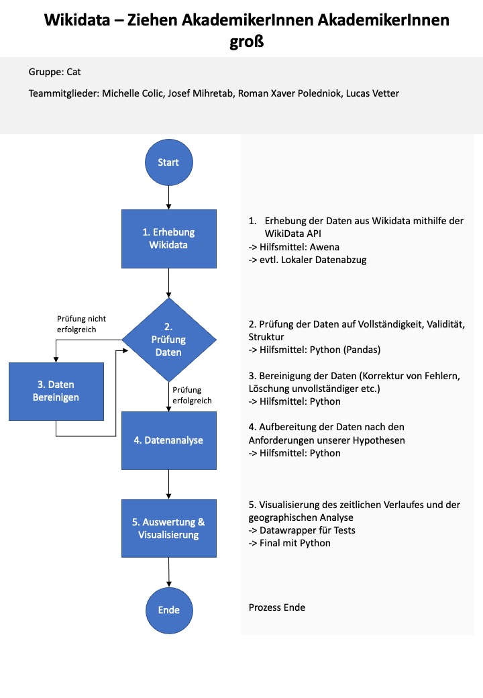

# dis18_graph_analysis
Graph analysis of a Wikidata graph

## Auswertungsziele

### 1. Jahresverlauf von Startjahr x bis Zieljahr y. Für jedes Jahr soll eine Prozentuale Aussage getroffen werden können: Wie hoch ist der Anteil an Eltern mit der Ausprägung (Academic Degree) + Kind mit der Ausprägung (Academic Degree)? 

#### Zu berücksichtigende Merkmale
* Geburtsdatum (P569)
* Academic Degree (P512)
** Q189533
* Father (P22)
* Mother (P25)

### 2. Geographische Analyse mithilfe eines Compound annual growth rating (CAGR): Durchschnittliche Veränderung für ausgewählte Länder in der Betrachtung von Startjahr x bis Zieljahr y.

#### Zu berücksichtigende Merkmale
* Country of citizenship (P27)
* Place of birth (P19)

### 3. Was wäre interessant, wenn die Zeit für das Projekt ausreicht?
* Trennung nach Geschlecht
* Erweiterung der Zeitspanne
* Betrachtung des persönlichen Umfelds (Partner, etc.)

## Flussdiagramm

